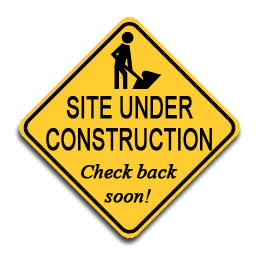

# localstack-demo
Demonstration project to run a full-stack AWS application in a local environment.

 

## What *Is* Complete
- [x] Basic Docker Compose file.
- [x] Basic instructions.
- [ ] Front-end project
- [ ] Back-end project

## How To Run
To start:
```shell
docker-compose up -d
```

To stop:
```shell
docker-compose down
```
Note that stopping the container deletes all the changes to the environments.  You will start with a clean environment
next time you run.

## How To Test

The key is to supply the `--endpoint-url` with a value of `http://localhost:4566` **on every command**.

For example, to create an S3 bucket, add a file, remove the file, and remove the bucket.
```text
sgelman@Delenn:~$ aws --endpoint-url=http://localhost:4566 s3 mb s3://bucket-1
make_bucket: bucket-1
sgelman@Delenn:~$ aws --endpoint-url=http://localhost:4566 s3 ls
2024-09-18 14:59:40 bucket-1

sgelman@Delenn:~$ aws --endpoint-url=http://localhost:4566 s3 cp EC2Tutorial.pem s3://bucket-1
upload: ./EC2Tutorial.pem to s3://bucket-1/EC2Tutorial.pem
sgelman@Delenn:~$ aws --endpoint-url=http://localhost:4566 s3 ls s3://bucket-1
2024-09-18 15:01:17       1678 EC2Tutorial.pem
sgelman@Delenn:~$ aws --endpoint-url=http://localhost:4566 s3 ls s3://bucket-1 --human-readable
2024-09-18 15:01:17    1.6 KiB EC2Tutorial.pem

sgelman@Delenn:~$ aws --endpoint-url=http://localhost:4566 s3 rm s3://bucket-1/EC2Tutorial.pem
delete: s3://bucket-1/EC2Tutorial.pem
sgelman@Delenn:~$ aws --endpoint-url=http://localhost:4566 s3 ls s3://bucket-1 --human-readable

sgelman@Delenn:~$ aws --endpoint-url=http://localhost:4566 s3 rb s3://bucket-1
remove_bucket: bucket-1
sgelman@Delenn:~$ aws --endpoint-url=http://localhost:4566 s3 ls
sgelman@Delenn:~$
```

## References

Similar to how this project works: [Running Localstack with Docker](https://mmarcosab.medium.com/running-localstack-with-docker-7c6597acddd1)

[Official Docker Documentation](https://hub.docker.com/r/localstack/localstack)

Using awslocal CLI: [Using LocalStack with Docker Compose to mock AWS services](https://whattodevnow.medium.com/using-localstack-with-docker-compose-to-mock-aws-services-bb25a5b01d4b)

AWS Blog: [Accelerating software delivery using LocalStack Cloud Emulator from AWS Marketplace](https://aws.amazon.com/blogs/awsmarketplace/accelerating-software-delivery-localstack-cloud-emulator-aws-marketplace/)

This is a slightly difference way to run LocalStack using Docker Extensions:
[Develop Your Cloud App Locally with the LocalStack Extension](https://www.docker.com/blog/develop-your-cloud-app-locally-with-the-localstack-extension/)


